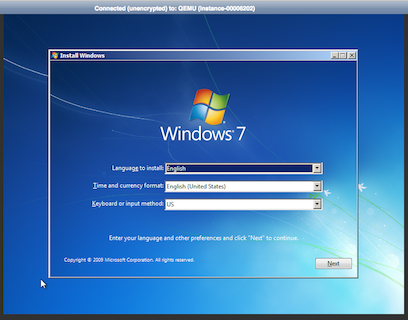
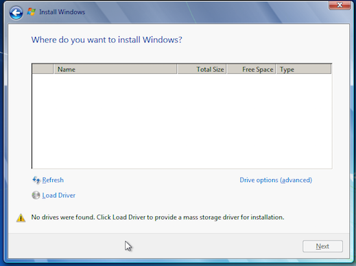
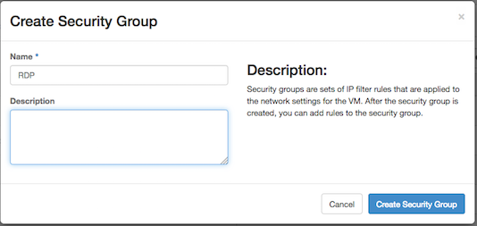
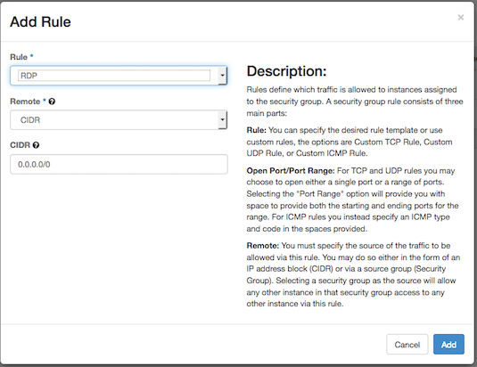
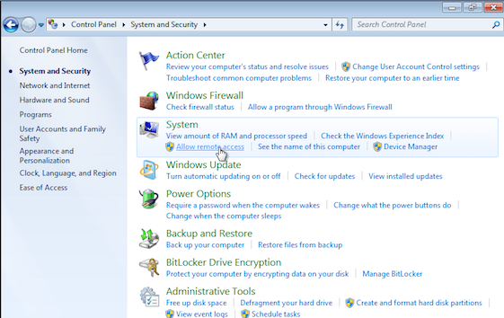
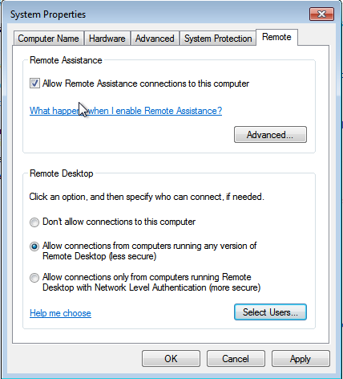
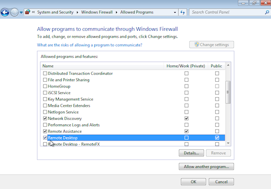

# Creating a Windows Instance

Researchers from The University of Melbourne are able to run Windows 7 instances on the [Nectar](http://nectar.org.au/) cloud, however it takes a little extra work due to licensing requirements.

Here's how you do it:

1\. First, decide what size instance you require. If a one or two core machine is sufficient, the m2.tiny, m2.xsmall (one core) and m2.medium (two core) flavors will work as expected. If you need more than two cores, you'll need to request access to Windows-specific flavors, mel.win.large (8 core) and mel.win.huge (32 core). These special flavors are required so that Windows can access all of the cores.

2\. Have you requested a resource allocation from Nectar? You’ll receive a default allocation with your trial project (beginning with ‘pt-’), but this usually won’t be sufficient. Decide how many cores you require, and how much volume storage. For the latter, allow around 100GB per instance, plus any additional space needed for your software. You can request resources in the ‘Allocations’ menu in the sidebar. If you’re creating a new project, you’ll have to wait until it’s approved and you have a project ID before proceeding to the next step.

3\. Send a request to support (support@ehelp.edu.au), letting us know you'd like to run a Windows instance, and require the following:

* Access to the Windows 7 install image.
* Access to the melbourne-qh2-uom availability zone
* Access to the Windows-specific flavors mentioned above, if required.

Be sure to provide your project name.

4\. Once support has acted upon your request, you should notice a new image in your project. Launch an instance from the install image, select your desired flavor, and make sure melbourne-qh2-uom is set as your availability zone (you'll need to select 'Advanced').

5\. Your windows machine will now start, booting from the install image (this is like booting from an install DVD or USB drive). Select your instance, and navigate to the console tab.

Then click 'Click here to show only console'. This will open a browser interface to your windows machine, and after a few minutes the Windows install tool will start. Work through the install steps, selecting the 'Custom (Advanced)' install option.

6\. Some Nectar flavors don't include a volume, and so the installer will complain. You'll need to create one (https://dashboard.rc.nectar.org.au/project/volumes/) and attach it to your instance.

 
* Start with a volume of at least 100 GB, more if the software you plan to install requires it. You may need to request a volume storage allocation if you don't have one already. 
* Make sure the availability zone is set to melbourne-qh2-uom (the same as your instance).
* Make sure your volume is set as bootable.
* Attach the volume to your instance.
* **You may need to reboot your instance so that it detects the new volume (there is no need to partition the volume manually, i.e. using diskpart, a blank volume is fine).**

7\. You should now be able to install Windows normally, and continue to use it via the browser interface.

# How to Enable Remote Desktop Connection on your Windows Instance
While the browser interface is functional, it's probably not ideal for most users (for instance, you can’t share files, copy and paste, or get a full screen interface). You can enable Remote Desktop connections to your instance with the following steps:

1\. Create a security group named 'RDP', attach the 'RDP' rule, and add to your instance. This will make sure the necessary ports are open on your instance to receive Remote Desktop connections.

2\. Via the browser interface, go the Windows Control Panel in your instance, and enable Remote Desktop connections.

3\. Finally, in your Windows Firewall settings, make sure Remote Desktop is set as an allowed program.

# Important Security Notes
Your instance is now accessible to the world, and so it's very important you take steps to keep it secure.

* Strongly consider limiting the IP address range for your RDP security group to that used by the university VPN (Staff: 10.1.128.0/22, student: 10.9.128.0/22). This means you’ll have to open a VPN connection before connecting to your instance, but will drastically reduce the potential for unauthorised access.
* Make sure you have a strong password, and that guest access is disabled.
* Make sure automatic updates are enabled, and periodically check that security updates are being applied.
* If you have sensitive data, consider encrypting it (e.g. using the BitLocker tool built into Windows).
* If possible, keep your Windows instance shut down when you're not using it, or at least remove the RDP security group so that remote access is disabled.

# Activating Windows
By default, Nectar instances do not sit within the University network, and so may not be able to reach our central license server. 

We're working on a solution for this, but in the meantime here are your options if Windows complains that it cannot activate.

A) If your instance will only be used for a short time (<30 days), you can simply terminate your instance when no longer required and not worry about activation.

B) Alternatively, setup a VPN connection (https://remote.unimelb.edu.au/staff) between your instance and the University's network so that the license server can be reached. It may be necessary to disconnect your Remote Desktop Session after initiating the VPN connection (or use the web-based console) and then reconnect after a few minutes for this to succeed.

